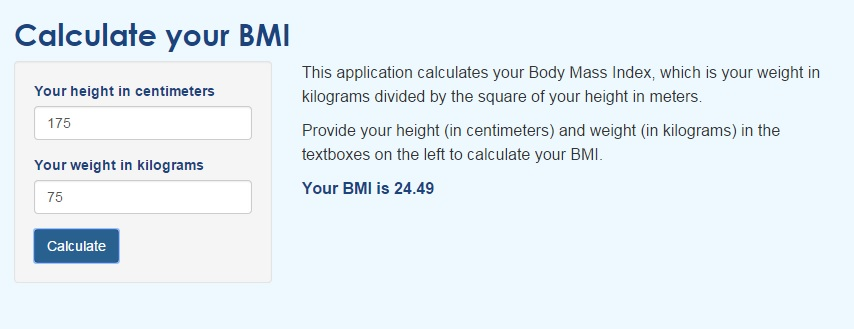

---
title       : Developing Data Products
subtitle    : BMI calculator
author      : Yeo Chai Heng
job         : Application Developer
framework   : io2012        # {io2012, html5slides, shower, dzslides, ...}
highlighter : highlight.js  # {highlight.js, prettify, highlight}
hitheme     : tomorrow      # 
widgets     : [mathjax]            # {mathjax, quiz, bootstrap}
mode        : selfcontained # {standalone, draft}
knit        : slidify::knit2slides
---  #page2 

## About the bmi calculator

The Body Mass Index can be a good way for us to decide whether we need to cut some weight in order to stay healthy. 

The BMI calculator takes your height in centimeters and weight in kilograms and calculate your BMI using the following formula:

$$BMI = \frac{ weightInKilograms }{ heightInMeters^2}$$

To make the BMI calculator avaliable for use anytime and anywhere, it is hosted at http://clivant.shinyapps.io/bmi-calculator/.

--- #page3

## An example

Supposed my height is 175 centimeters and I weigh 75 kilograms, my BMI will be:


```r
75 / (1.75) ^ 2
```

```
## [1] 24.4898
```

--- #page4

## Getting my BMI from the user interface



--- #page5

## References

* http://en.wikipedia.org/wiki/Body_mass_index
* http://shiny.rstudio.com/tutorial/


